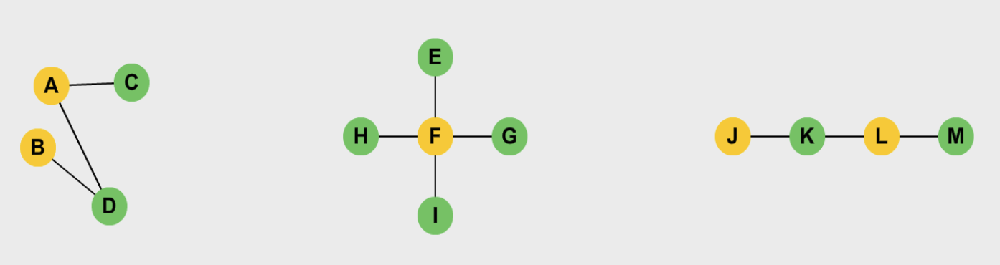
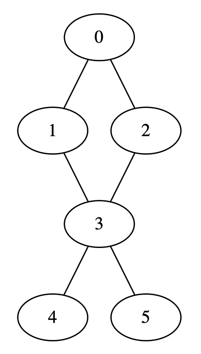

# Graph

A **graph** is a set of nodes that are connected to each other in the form of a network. It has two basic components, include:

* Vertex - Vertices are similar to linked list nodes. A collection of vertices forms a graph.
* Edge - An edge is the link between two vertices. It can be uni-directional or bi-directional. An edge can also have a cost associated with it.

## Graph terminologies

1. **Degree of a Vertex**: The total number of edges incident on a vertex. There are two types of degrees:
* **In-Degree**: The total number of incoming edges of a vertex.
* **Out-Degree**: The total number of outgoing edges of a vertex.

2. **Parallel Edges**: Two undirected edges are parallel if they have the same end vertices. Two directed edges are parallel if they have the same starting and ending vertices.

3. **Self Loop**: This occurs when an edge starts and ends on the same vertex.

4. **Adjacency**: Two vertices are said to be adjacent if there is an edge connecting them directly.

## Types of graphs

* **Undirected graph** - the edges are **bi-directional**. For a graph with $n$ vertices, there are $n(n-1)/2$ maximum possible edges.
* **Directed graph** - the edges are **uniddirectional**. For a graph with $n$ vertices, there are $n(n-1)$ maximum possible edges.

## Ways to represent a graph

* **Adjacency matrix** - a two-dimensional matrix where each cell can contain a 0 or 1, where 1 means that there exists an edge between the correcponding vertices.

* **Adjacency list** - an array of linked list is used to store all the edges in the graph.

## Complexities of graph operations

In the table below, $V$ means the total number of vertices and $E$ means the total number of edges in the graph.

| Operation | Adjacency list | Adjacency matrix |
|---|:---:|:---:|
| *Add vertex* | $O(1)$ | $O(V^2)$ |
| *Remove vertex* | $O(V+E)$ | $O(V^2)$ |
| *Add edge* | $O(1)$ | $O(1)$ |
| *Remove edge* | $O(E)$ | $O(1)$ |
| *Search* | $O(V)$ | $O(1)$ |
| *Breadth first search (BFS)* | $O(V+E)$ | $O(V^2)$ |
| *Depth first search (DFS)* | $O(V+E)$ | $O(V^2)$ |

### Adjacency list

Better when the application frequently manipulates vertices

* Adding an edge in adjacency lists takes constant time as we only need to insert at the head node of the corresponding vertex
* Removing an edge takes $O(E)$ time because, in the worst case, all the edges could be a single vertex and hence, we would have to traverse all E edges to reach the last one.
* Removing a vertex takes $O(V+E)$ time because we have to delete all its edges and then reindex the rest of the list tn step back in order to fill the deleted spot.
* Searching an edge between a pair of vertices can take up to $O(V)$ if all V nodes are present at a certain index and we have to traverse them.

### Adjacency matrix

Better when the application frequently manipulates edges

* Edge operations are performed in constant time as we only need to manipulate the value in the particular cell.
* Vertex opertions are performed in $O(V^2)$ since we need to add rows and columns. We will also need to fill all the new cells.
* Searching an edge is $O(1)$ because we can access each edge by indexing.

## Bipartite graph

The vertices of the **bipartite graph** are divided into two disjoint parts in such a way that no two vertices in the same part are adjacent to each other.

The bipartite graph is a type of **k-partite graph** where **k** is 2.

A **cyclic** graph is one in which the edgs form a cycle between the vertices like below. It can also be bi-partite.

All the **acyclic** graphs can be bi-partite, but for **cyclic** graphs, they must contain an even number of vertices to be bi-partite.

Popular bipartite graphs:
* Star graph
* Acyclic graph
* Path graph

## Graph traversal algorithms

Any traversal needs a starting point, but a graph does not have a linear strucutre like lists or stacks. This is where the concept of **levels** is introduced.

Take any vertex as the starting point. This is the lowest level in your search. The **next level** consists of all the vertices adjacent to the staring vertex. A level higher would mean the vertices adjacent to the nodes at the lower level.

### 1. Breadth first search (BFS)

The BFS algorithm grows breadth-wise. All the nodes at a certain level are traversed before moving onto the next level.

### 2. Depth first search (DFS)

The DFS algorithm grows depth-wise. Starting from any node, we kepp moving to an adjacent node until we reach the furthest level. Then we move back to the starting point and pick another adjacent node. At every step, a node on a new level is visited.s